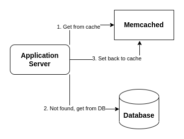
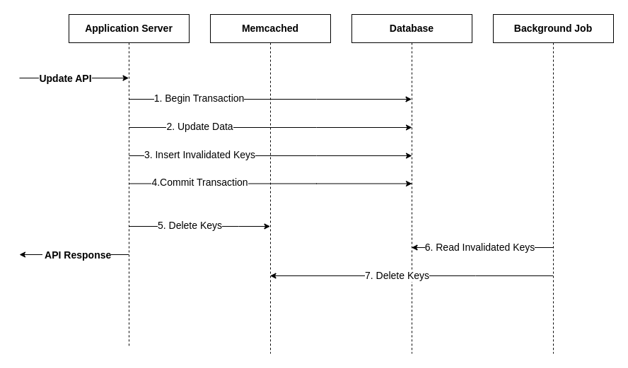
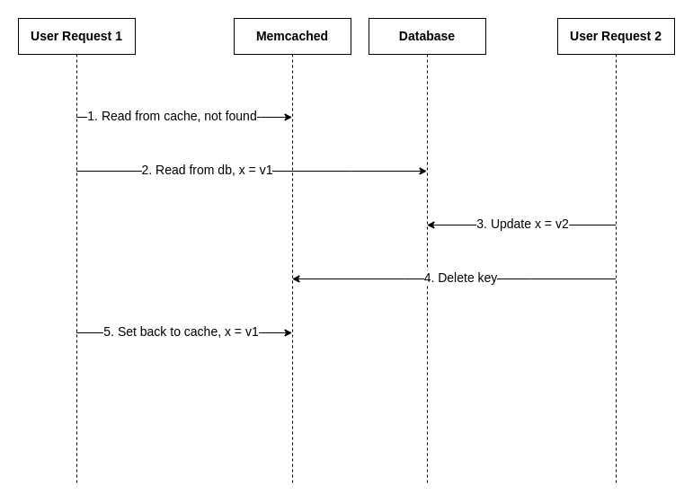

# Consistency between Memcached and Database

Memcached, as the name suggests, most commonly used as Cache Server
for protecting other data sources, often be the databases.

The recommended way to use memcached is the **Cache-Aside Pattern**.
In which, the user requests will hit the memcached server first.
And only if memcached does not contain the data, the application server will
fetch from the backing sources (e.g. Databases),
and then set back the fetched data to the memcached server.



### But how to make the data consistent between memcached and database?

The solution will be used for this library is **invalidating (deleting) keys on database updates**.

The general flow will look like this:


1. First, user request will open a transaction, does the update as normal,
   and then the application will specifies and inserts the list of **invalidated keys** in some table before
   commit the transaction (*Step 1 to 4*).
   Reader familiar with patterns in distributed systems & microservices
   will recognize this
   as [Transaction Outbox Pattern](https://microservices.io/patterns/data/transactional-outbox.html).
   This pattern allow to guarantee the keys in the memcached server will be deleted accordingly.
2. After the transaction has been committed, the application will delete the keys in the memcached server
   in the same thread user request is running before returning to the users (*Step 5*).
   This step serves two purposes:
    * Keeps the **read-your-own-writes consistency** in the normal condition (no failure occurs).
    * Helps mitigate the case the background job not working,
      or it can not proceed because some errors has not been handled gracefully.
3. The background job read the invalidated keys and does the deletion again (*Step 6 and 7*).

### Race condition when deleting keys

Even with the Transactional Outbox Pattern, there is still a **race condition**
that can make data in the cache be **staled indefinitely**.

Consider the execution:



1. At the start, the database contains the variable **x = v1**, the memcached server is empty.
2. **User Request 1** read from memcached => not found the cached key for **x** => then does the read from database.
3. In the same time, **User Request 2** started, update the variable **x** from **x = v1** to **x = v2**.
   And then do delete the key on memcached server, this deletion does nothing because no key existed in the cache.
4. **User Request 1** experiences a network problem that makes the **Set back to cache with x = v1**
   operation take quite a long time,
   long enough that the step 4 **Delete key** has already completed.

The final result, memcached server will store the cache key contains **x = v1**
and serves that staled value **indefinitely** unless other updates happened for the key **x**.

### Lease Mechanism for solving the Stale Set Problem

The idea using Lease is from the paper
[Scaling Memcache at Facebook](https://www.usenix.org/system/files/conference/nsdi13/nsdi13-final170_update.pdf).

In the **step 1**, when not found, instead of return no result, memcached server will put
an item with an empty value, a TTL and a **Lease Token** (**cas** number in memcached terminology).
That **lease token** will be returned to the client.

And instead of simply **set back to cache** in **step 5**, the client need to pass the **lease token**
to the memcached server in the set command. And memcached server will only update **x = v1** into its hash table
**ONLY IF** the key is still existed and **lease token** is equal.

In the new memcached server, the get command will be:

```
mg userkey v c N3\r\n
```

The flag ``v`` indicates the value is returned, flag ``c`` is for returns ``cas`` number,
and then flag ``N3`` means that when the key ``userkey`` not existed,
the memcached server will create a new item will ``TTL=3s``.

For the set command:

```
ms userkey 4 C1234\r\n
ABCD\r\n
```

With the value size is 4 bytes and value is ``ABCD``. This command will be ignored if the key ``userkey`` not existed
or ``cas`` number
stored in the item is not currently equals ``1234``.

More detail in:

* https://github.com/memcached/memcached/wiki/MetaCommands
* https://github.com/memcached/memcached/blob/master/doc/protocol.txt
