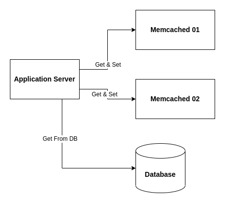

# Memcache Replication & Memory-Weighted Load Balancing

In normal database systems, the replication mechanisms often using some form of operation logs.

For example:

* Binlog in MySQL.
* A stream of commands in the case of Redis.
* Write-Ahead Log in Postgres.

One problem with this kind of replication is that it is often
asynchronous for performance reasons. For that it is impossible to guarantee **strong consistency**.

For example, in case of Redis Sentinel, when a new election happens,
the new master will lose the latest acknowledged writes.

Moreover, Memcached does NOT support a stream of operation logs to allow to do replication in this way.
Instead, in this library, the replication will use the mechanism similar to
[MCRouter](https://github.com/facebook/mcrouter/wiki/Replicated-pools-setup)

## Replication for Cache-Aside Pattern

Instead of the memcached servers itself doing replication, when the ``application server``
fetching from the cache, it will choose, with a configured load balancing algorithm, a memcached server
and get the desired keys from that memcached server.

If the keys do NOT existed, it will do the fetch from Database and set back values to that memcached server.
After some times, both memcached servers will contain mostly the same data from the backing Database.

### Fail-over & High Availability

With that setup, a simple fail-over can be implemented simply as:

1. First, choose a memcached server and get from that server.
2. If the response is ok, the memcached server is still alive, response back to the client.
3. If the response is NOT ok, choose a memcached server from the remaining servers, and
   does the same thing as the step 1.

This library implemented actually like this, and to prevent retrying too many times,
it will do the step 3 **ONCE**. If the second chosen memcached server is also NOT alive,
the library will return back that error to the client.

All of that retry logic also be implemented using the principle in the [Efficient Batching](efficient-batching.md).

### Memory-Weighted Load Balancing

To support better cache utilization, instead of doing round-robin or a simple random selection for Replication.
This library is relying on the actual memory usage of the memcached servers to do load-balancing.

For example, if we have 2 memcached servers ``memcached 01`` and `memcached 02`:

* If ``memcached 01`` memory usage is ``256MB``, the ``memcached 02`` memory usage is also ``256MB``
  => then both will serve randomly ``50%`` of traffic.
* If ``memcached 01 = 80MB``, ``memcached 02 = 0MB``, the ``memcached 01`` will serve ``99%``
  and ``memcached 02`` will be ``1%``, this ``1%`` value can be changed by using the ``proxy.WithMinPercentage()``
  option.
* If ``memcached 01 = 80MB``, ``memcached 02 = 40MB`` =>
  then the ``memcached 01`` will serve ``80 / (80 + 40) = 66.67%`` traffic.

  If the option ``proxy.WithMemoryScoringFunc()`` be used with the function ``f(x)``. Then the formula
  becomes: ``f(80) / (f(80) + f(40))``.

Note that the ``memory usage`` is actually RAM usage that used for keys in memcached,
not the RAM usage that memcached server allocated from underlining OSes.
That ``memory usage`` will be ``zero`` after the command ``flush_all`` is executed.

#### Previous: [Efficient Batching](efficient-batching.md)
