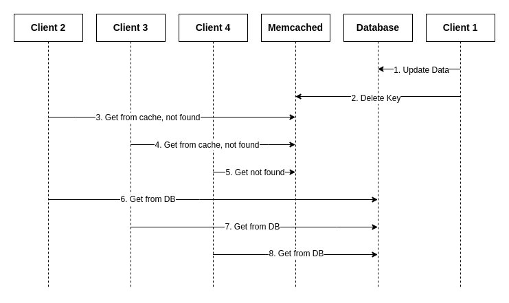

# Preventing Thundering Herd

A well known problem when using Cache-Aside Pattern, especially when doing **invalidate keys on update**,
is the Thundering-Herd problem (also known as **Cache Stampede**).

It happens when a frequently accessed key being deleted from the cache, and many
clients concurrently get the same key from the cache => not found =>
all accessing to the backing database to get the same key.



This make the operation **delete key** becomes expensive, and the database
might not keep up with the sudden increase of traffic.

### Using Lease Mechanism to Prevent Thundering Herd

The lease mechanism ([Lease for solving stale set](consistency.md#lease-mechanism-for-solving-the-stale-set-problem))
can be extended to help solving the thundering herd problem.

* The first **lease get** after key being deleted will create a new item and return the ``cas`` number as normal.
* The second **lease get** will receive a flag indicate that it is the second **lease get**,
  for the memcached meta commands, when the ``N`` flag is used, this set of flags might be returned:

```
These extra flags can be added to the response:
- W: client has "won" the recache flag
- X: item is stale
- Z: item has already sent a winning flag
```

Reference [Memcache Protocol](https://github.com/memcached/memcached/blob/master/doc/protocol.txt).

In this library, after receiving the ``Z`` flag, the client will sleep for specified durations
(configured by the option ``item.WithSleepDurations``).

And the behaviour after all the retries in ``item.WithSleepDurations`` can be configured by
``item.WithEnableErrorOnExceedRetryLimit``, ``enable = true`` will return error, ``enable = false``
will continue get from the backing store and set back to the memcached server.

#### Previous: [Consistency between Memcached and Database](consistency.md)
#### Next: [Efficient Batching](efficient-batching.md)
